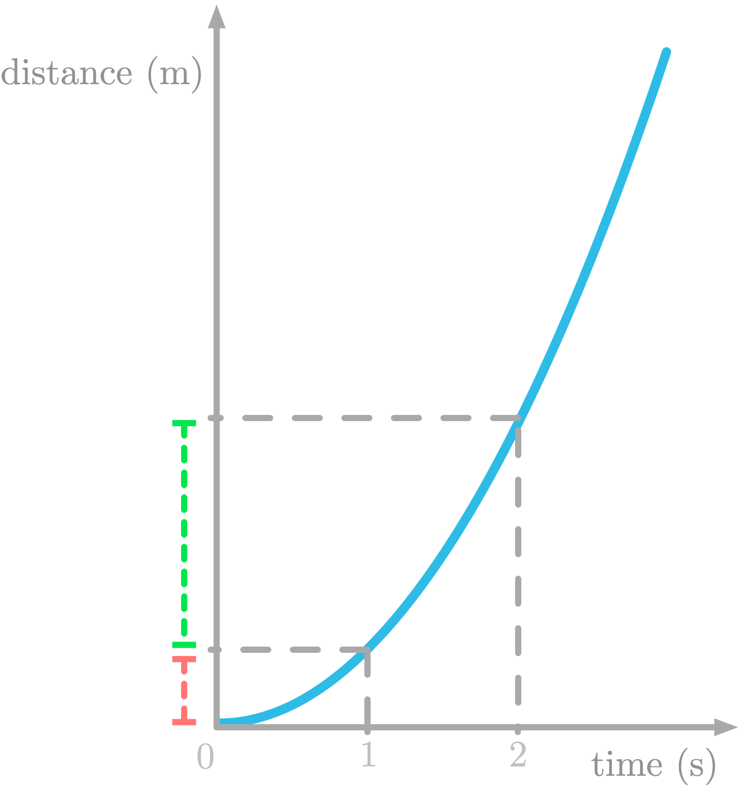
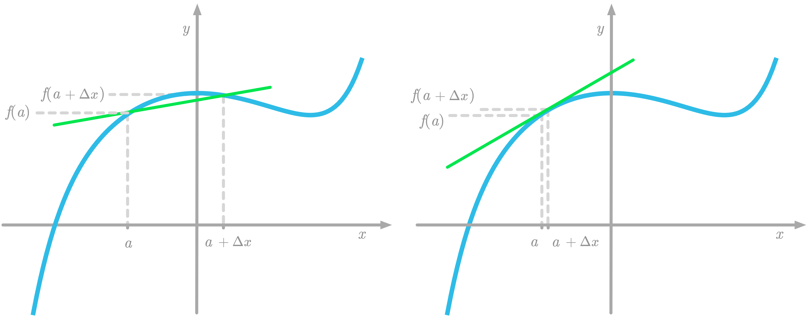
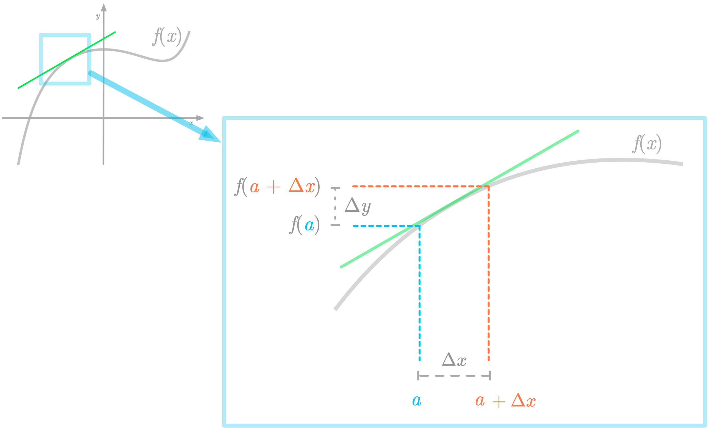

Calculus
=========
Calculus is a branch of mathematics that gives tools to study rate of change
of functions trough two main areas: derivatives and integrals

Derivatives
------------
The derivative of a function is related to its rate of change. The rate of change
tells you how much the output of the function changes when a change is done
to the input. It is calculated as the ratio between a change in the output and
the corresponding change in the input.

You measure the distance traveled (in meters) of a moving train as a function of time (in seconds), as
represented in Figure.

Distance is represented as a function of time. Now, say that you record the speed of the train.

.. image:: _static/calculus/distance_speed.png
   :width: 400

The slope in the left panel corresponds to the rate of change of the function at this point. For instance,
if you take the red slope, you can see that in one unit of time, the distance traveled is 2 meters (for instance,
between  𝑥=0  and  𝑥=1 , you go from  𝑦=−1  to  𝑦=1 ).

Mathematically, the plot in the right figure shows the derivative of the function plotted in the left figure.
The derivative of a function  𝑓  with respect to  𝑥  is the rate of change of  𝑓  as a function of  𝑥.
The derivative of  𝑓  is another function which takes  𝑥  as input and returns the slope of the tangent line of
𝑓  at this value of  𝑥.

Limits
^^^^^^
that the derivative at a point of a function is the slope of the tangent line at this point.
We consider that the distance between these two points, usually called  Δ𝑥.

Mathematically, the difference between the two points on the curve when  Δ𝑥  approaches zero is denoted as

.. math::
    \lim_{\Delta x \to 0} f(x + \Delta x) - f(x)

This is the concept of *limit*: this expression is read as “the limit of :math:`f(x + \Delta x) - f(x)` as
:math:`\Delta x` approaches zero”.

:math:`f(x + \Delta x) - f(x) as \Delta x` approaches zero”.

**Calculating Derivatives**

The rate of change is given by the slope of the tangent line.

.. math::
    \frac{\Delta y}{\Delta x} = \frac{f(a + \Delta x) - f(a)}{\Delta x}

When Delta x approaches zero, this is the *differentiation equation*,
used to calculate the derivative of the function f with respect to
x. It is denoted as:

.. math::
    \frac{d f(x)}{dx} = \lim_{\Delta x \to 0} \frac{f(x + \Delta x) - f(x)}{\Delta x}

With the *Leibniz notation*, you write:

.. math::
    \frac{d f(x)}{dx}

Derivatives of Linear And Nonlinear Functions
^^^^^^^^^^^^^^^^^^^^^^^^^^^^^^^^^^^^^^^^^^^^

You can extract rules from the fact that a function derivative corresponds to its rate of change.

**Constant Function**

The rate of change of a function is equal to zero when y does not
depend on $x$ (when the value of $y$ is the same for any x). For
instance, take the function f(x) = 4.